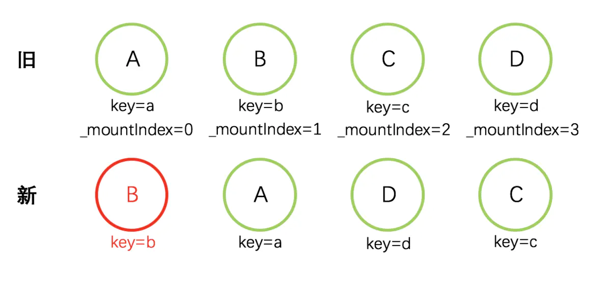
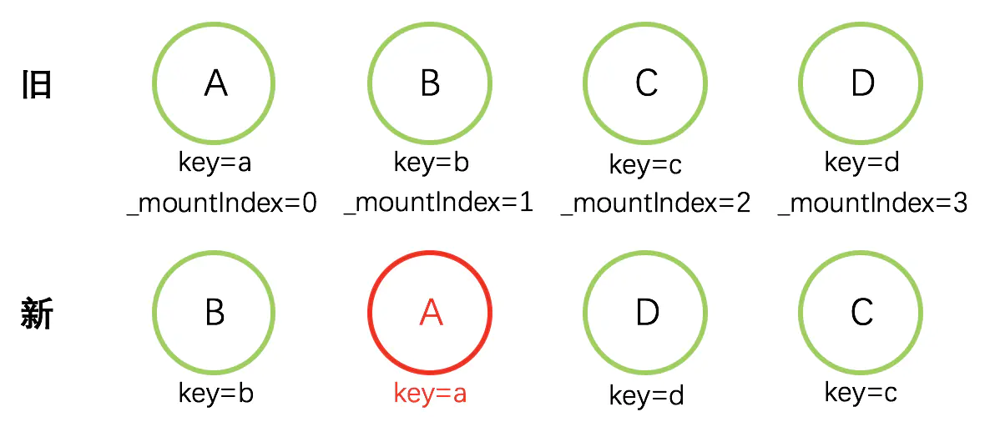
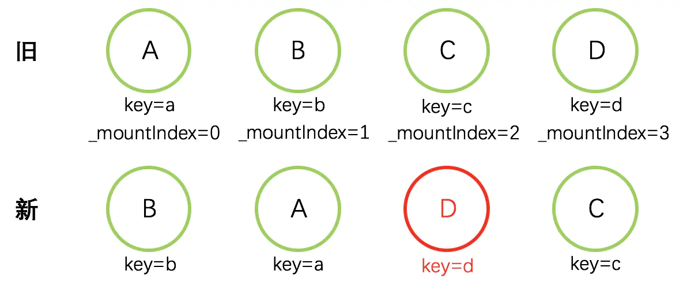

<!--
 * @Author: tangdaoyong
 * @Date: 2021-02-18 10:13:04
 * @LastEditors: tangdaoyong
 * @LastEditTime: 2021-02-18 11:19:29
 * @Description: diff
-->
# React diff 算法

## 介绍

[传统的diff算法](https://grfia.dlsi.ua.es/ml/algorithms/references/editsurvey_bille.pdf)
通过循环递归来对节点进行依次比较还计算一棵树到另一棵树的最少操作，算法复杂度为`O(n^3)`，其中`n`是树中节点的个数。尽管这个复杂度并不好看，但是确实一个好的算法，只是在实际前端渲染的场景中，随着`DOM`节点的增多，性能开销也会非常大。而`React`在此基础之上，针对前端渲染的具体情况进行了具体分析，做出了相应的优化，从而实现了一个稳定高效的`diff算法`。

## diff 算法

### diff策略

1. `Web UI`中`DOM`节点跨层级的移动特别少，可以忽略不计。
2. 拥有相同类的两个组件将会生成相似的树形结构，拥有不同类的两个组件将会生成不同的树形结构。
3. 对于同一层级的一组(具有相同父元素的)子节点，它们可以通过唯一`id`进行区分(即`key`)。

### tree diff

`tree diff`即：两棵组件树之间的比较，比较的是两棵树的**结构**。

基于`diff策略1`，`React`对树的算法进行了简洁明了的优化，即：`对树进行分层比较，两棵树只会对同一层次 的节点进行比较`。

**【注意】** 这里比较的的，是同一父节点下的所有子节点。如下图，`React`只会对相同颜色方框内的`DOM`节点进行比较:

### component diff

`component diff`即：组件的差异比较过程。是**数据层面**的差异比较。

1. 如果都是同一类型的组件(即：两节点是同一个组件类的两个不同实例，比如：`

`与`

`)，按照原策略继续比较`Virtual DOM`树即可。
2. 如果出现不是同一类型的组件，则将该组件判断为`dirty component`，从而替换整个组件下的所有子节点。

**注意**对于同一类型的组件，有可能其`Virtual DOM`没有任何变化(即：子节点的顺序、状态`state`等，都未发生变化)，如果能够确切知道这点，那么就可以节省大量的`diff`运算时间。因此，`React`允许用户通过`shouldComponentUpdate()`来判断该组件是否需要进行`diff`算法分析。

`component diff`比较的是：
* 同组节点集合内容，是否改变。即，假如某节点`A`在旧结构中拥有两个子节点`B`、`C`，如果新结构中`A`同样拥有`B`、`C`两个子节点，无论`B`、`C`位置是否交换，都认为`component`层面未发生改变。
* 相同组件数据是否改变。如某组件`A`的`state`等数据发生改变，`component diff`会发现差异，并进行组件的更新。

### element diff

`element diff`即：同一父元素下的节点集合，进行比较，真实`DOM`渲染前，比较节点结构的变化。

1. `INSERT_MARKUP`：新的组件类型不在旧集合里，即全新的节点。需要对新节点执行插入操作
2. `MOVE_EXISTING`：旧集合中有新组件类型，且`element`是可更新的类型。`generateComponentChildren`已调用`receiveComponent`，这种情况下`prevChild`=`nextChild`，就需要做移动操作，可以复用以前的`DOM`节点。
3. `REMOVE_NODE`：旧组件类型，在新集合里也有，但对应的`element`不同则不能直接复用和更新，需要执行删除操作，或者旧组件不在新集合里的，也需要执行删除操作。

`component diff` 后，准备好了所有的组件，都是新结构需要的组件，并且每个组件都包含了新的`state`等数据。
`element diff`是根据新的`DOM`结构，寻找由旧结构、更新至新结构最高效的方式。

#### element diff 节点移动

`element diff` 的前提是已经`component diff`比较过了，知道新旧两棵Virtual DOM树的树结构。

`总体流程`：

依次取出新集合中的每个节点，通过`key`值，确定当前节点是否存在于旧集合中，如果存在，再进行其他的比较、判断，确定旧集合中的此节点是否需要移动。

`重要变量`：

* `lastIndex`：一个标记值，只用作对比大小，来决定是否进行节点移动。初始值为`0`。
* `nextIndex`：新集合下一个要取的节点的坐标。用于确定新集合当前已取到第几个节点，从而继续遍历。初始值为`0`。
* `_mountIndex`：旧集合中当前节点的坐标。

**个人理解**`lastIndex`是旧数组中的游标，用于标识最后在新数组中出现的元素的`_mountIndex`。`nextIndex`是新数组中的游标，用于设置新数组中的`_mountIndex`，通过自增控制。

##### 步骤1

初始化：`lastIndex=0，nextIndex=0`。

取新集合第一个节点，`B`。

1. key=b，旧集合中存在。对应_mountIndex=1，此时lastIndex=0，nextIndex=0
2. if(child._mountIndex < lastIndex) ? ——No，节点不移动
3. lastIndex=Math.max(prevChild._mountIndex,lastIndex)。lastIndex=1
4. prevChild._mountIndex=nextIndex。新集合中，B._mountIndex=0
5. nextIndex ++ 。nextIndex=1，进入下一个节点的判断

##### 步骤2

取新集合第二个节点，`A`

1. key=a，旧集合中存在。对应_mountIndex=0，此时lastIndex=1，nextIndex=1
2. if(child._mountIndex < lastIndex) ? ——Yes，节点移动！
3. lastIndex=Math.max(prevChild._mountIndex,lastIndex)。lastIndex=1
4. prevChild._mountIndex=nextIndex。新集合中，A._mountIndex=1
5. nextIndex ++ 。nextIndex=2，进入下一个节点的判断

##### 步骤3

取新集合第三个节点，`D`

1. key=d，旧集合中存在。对应_mountIndex=3，此时lastIndex=1，nextIndex=2
2. if(child._mountIndex < lastIndex) ? ——No，节点不移动
3. lastIndex=Math.max(prevChild._mountIndex,lastIndex)。lastIndex=3
4. prevChild._mountIndex=nextIndex。新集合中，D._mountIndex=2
5. nextIndex ++ 。nextIndex=3，进入下一个节点的判断

##### 步骤4

取新集合第四个节点，`C`

1. key=c，旧集合中存在。对应_mountIndex=2，此时lastIndex=3，nextIndex=3
2. if(child._mountIndex < lastIndex) ? ——Yes，节点移动！
3. lastIndex=Math.max(prevChild._mountIndex,lastIndex)。lastIndex=3
4. prevChild._mountIndex=nextIndex。新集合中，C._mountIndex=3
5. nextIndex ++ 。nextIndex=4。发现新集合已经遍历完毕，diff操作到此完成

##### element diff 的缺点

如上`D`，此时`D`不移动，但它的`index`是最大的，导致更新`lastIndex=3`，从而使得其他元素`A,B,C`的`index<lastIndex`，导致`A,B,C`都要去移动。
理想情况是只移动`D`，不移动`A,B,C`。因此，在开发过程中，尽量减少类似将最后一个节点移动到列表首部的操作，当节点数量过大或更新操作过于频繁时，会影响`React`的渲染性能。